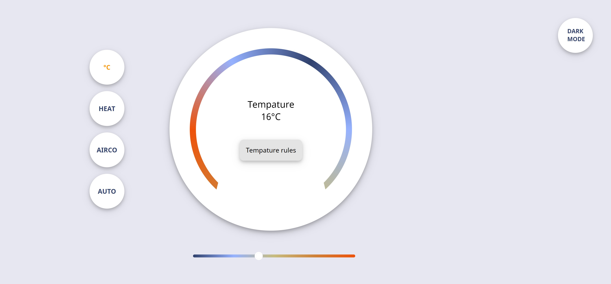
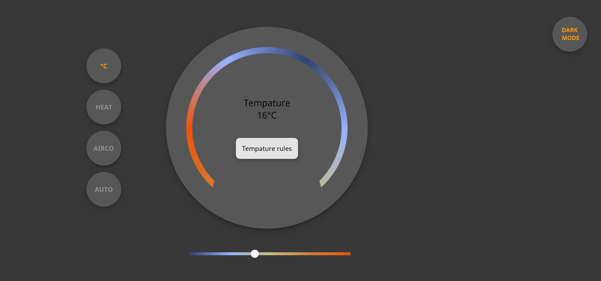

# Control panel - Temperature ruler 🌡️
Control paneel - temperature ruler for CSS to the Rescue

A control panel with a temperature rules

# 
# 

## Table of contents
  - [Table of contents](#table-of-contents)
  - [About](#about)
  - [Features](#features)
  - [Documentation](#documentation)
  - [Author](#author)
  - [Bronnen](#bronnen)

## About
Control pannel is een webapp waarbij je de temperattur kan regelen

## Features
<ul>
  <li>Verander de temperatuur met kleur indicator</li>
  <li>Kies uit verschillende opties voor de ideale temperatuur</li>
  <li>Voor prettige ervaring gebruik dark mode!</li>
</ul>

## Documentation
Lees hier mijn documentatie per week [wiki](https://github.com/Fabienne02/Control-panel/wiki) 

## Author
De maker van deze app is: [*Fabienne van den Steen*](https://github.com/Fabienne02)

## Bronnen 

Clippath Div(3)
https://bennettfeely.com/clippy/

Gradient voor beide slider en div(1)
https://www.css-gradient.com/

Slider opmaak
https://www.cssportal.com/style-input-range/

rotating fan
https://developer.mozilla.org/en-US/docs/Web/CSS/transform-function/rotate()

hide checkboxes (van sanne)
https://codepen.io/Fabienne02/pen/LYOXwwd

